<div align="center">


</div>

---

### `$ cat whoami.md`

```txt
> years spent turning designs into pixels, and pixels into products
> frontend-first, but never stopped at the browser — full-stack curiosity runs deep
> reads source code for fun, breaks things to understand them, then builds better ones
> believes the best comment is the one you didn't need to write
```

---

### `$ cat currently.log`

```diff
+ building   : full-stack tools & AI-assisted workflows
+ exploring  : what's running underneath — systems, protocols, the low-level stuff
+ learning   : Go, one small program at a time
! status     : shipping something, always
```

---

### `$ ls ./tech-stack`

```
tech-stack/
├── frontend/            React · Vue · TypeScript · Vite · Webpack
├── backend/             Node.js · Express · Koa · MongoDB
├── tooling/             Git · Docker · Jest · Figma
└── beyond-the-browser/  Go · systems tinkering · reading other people's bytecode
```

---

### `$ ls ./featured-projects`

```text
⭐  2   lularible-books       a reading site for automotive-electronics deep dives
⭐  9   React-video-editor
⭐ 16   wxCNode
⭐  5   next-shop
```

---

### `$ ./github-stats.sh`

<div align="center">





</div>

<div align="center">

`$ echo "thanks for reading this far"` 🐍

</div>
